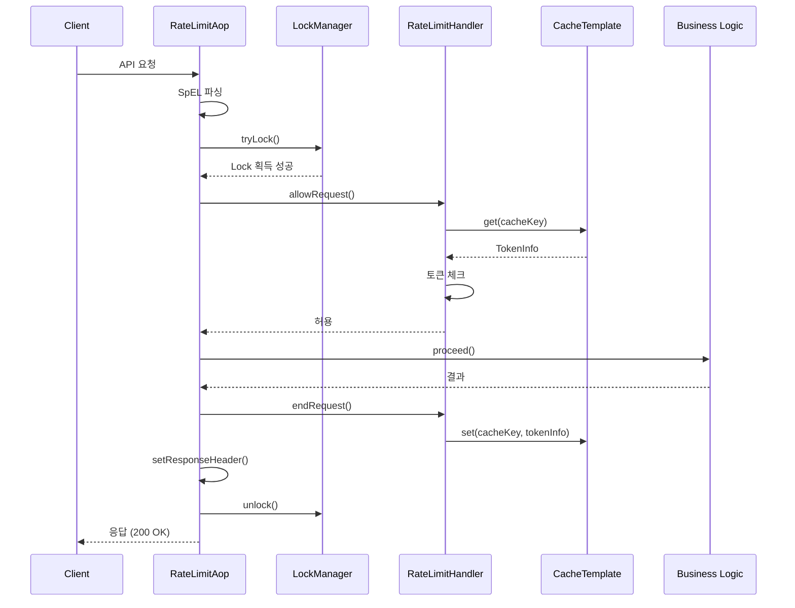
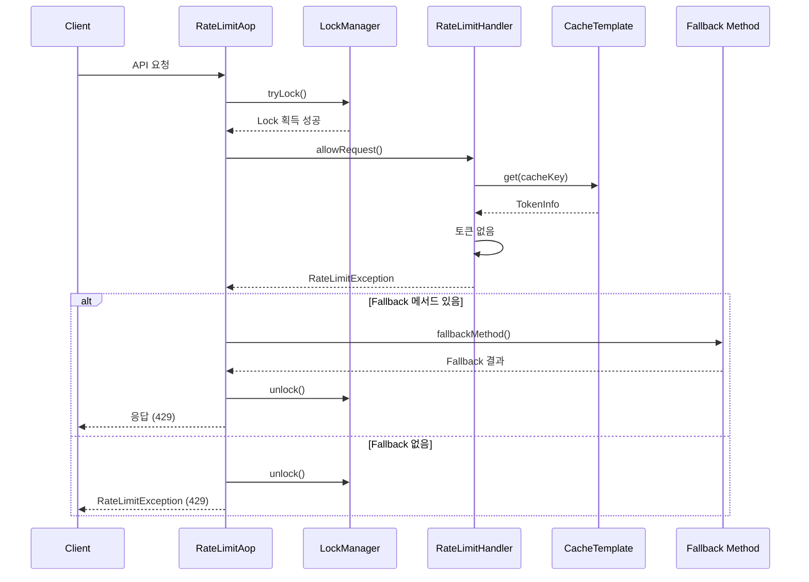

# 아키텍처 문서

이 문서는 Rate Limiter Spring Boot Starter의 전체 아키텍처와 설계 결정을 설명합니다.

## 목차

-   [전체 아키텍처](#전체-아키텍처)
-   [모듈 구조](#모듈-구조)
-   [핵심 컴포넌트](#핵심-컴포넌트)
-   [실행 흐름](#실행-흐름)
-   [설계 결정](#설계-결정)
-   [확장 포인트](#확장-포인트)

---

## 전체 아키텍처

```
┌─────────────────────────────────────────────────────────────────┐
│                        Application Layer                         │
│  ┌──────────────────────────────────────────────────────────┐  │
│  │              @RateLimiting Annotation                     │  │
│  │  (Controller, Service, Repository Methods)               │  │
│  └──────────────────────────────────────────────────────────┘  │
└───────────────────────────┬─────────────────────────────────────┘
                            │
┌───────────────────────────▼─────────────────────────────────────┐
│                          AOP Layer                               │
│  ┌──────────────────────────────────────────────────────────┐  │
│  │                  RateLimitAop                            │  │
│  │  - Intercept @RateLimiting methods                       │  │
│  │  - Parse SpEL expressions                                │  │
│  │  - Manage Lock lifecycle                                 │  │
│  │  - Set response headers                                  │  │
│  └──────────────────────────────────────────────────────────┘  │
└───────────┬─────────────────────────┬───────────────────────────┘
            │                         │
┌───────────▼───────┐   ┌─────────────▼───────────┐
│   Lock Manager    │   │   Rate Limit Handler    │
│                   │   │                         │
│  ┌─────────────┐ │   │  ┌──────────────────┐  │
│  │  Redisson   │ │   │  │ Token Bucket     │  │
│  │   Lock      │ │   │  │ Leaky Bucket     │  │
│  └─────────────┘ │   │  │ Fixed Window     │  │
│                   │   │  │ Sliding Window   │  │
│  ┌─────────────┐ │   │  │ Logging          │  │
│  │   Local     │ │   │  │ Sliding Window   │  │
│  │   Lock      │ │   │  │ Counter          │  │
│  └─────────────┘ │   │  └──────────────────┘  │
└───────────┬───────┘   └─────────┬───────────────┘
            │                     │
            │         ┌───────────▼──────────┐
            │         │   Cache Template     │
            │         │                      │
            │         │  ┌────────────────┐ │
            │         │  │ Redis Cache    │ │
            │         │  └────────────────┘ │
            │         │                      │
            │         │  ┌────────────────┐ │
            │         │  │  Local Cache   │ │
            │         │  └────────────────┘ │
            │         └──────────┬───────────┘
            │                    │
┌───────────▼────────────────────▼──────────────┐
│              Infrastructure Layer              │
│  ┌─────────────┐         ┌─────────────────┐ │
│  │   Redis     │◄────────┤   Redisson      │ │
│  │   Server    │         │   Client        │ │
│  └─────────────┘         └─────────────────┘ │
└───────────────────────────────────────────────┘
```

---

## 모듈 구조

### 1. rate-limiter (핵심 모듈)

**책임**: Rate Limiting 핵심 로직 구현

```
rate-limiter/
├── annotations/                # 어노테이션 정의
│   └── RateLimiting.java
├── aop/                        # AOP 처리
│   ├── RateLimitAop.java
│   ├── CustomSpringELParser.java
│   ├── RateLimitingProperties.java
│   ├── RateType.java
│   └── LockType.java
├── handler/                    # 알고리즘 핸들러
│   ├── RateLimitHandler.java (Interface)
│   ├── TokenBucketHandler.java
│   ├── LeakyBucketHandler.java
│   ├── FixedWindowCounterHandler.java
│   ├── SlidingWindowLoggingHandler.java
│   └── SlidingWindowCounterHandler.java
├── domain/                     # 도메인 모델
│   ├── AbstractTokenInfo.java
│   ├── TokenBucketInfo.java
│   ├── LeakyBucketInfo.java
│   ├── FixedWindowCountInfo.java
│   ├── SlidingWindowLoggingInfo.java
│   ├── SlidingWindowCounterInfo.java
│   ├── BucketProperties.java
│   └── RateUnit.java
├── cache/                      # 캐시 추상화
│   ├── CacheTemplate.java (Interface)
│   └── BucketRedisTemplate.java
└── lock/                       # Lock 관리
    ├── LockManager.java (Interface)
    ├── RedisRedissonManager.java
    └── ConcurrentHashMapManager.java
```

### 2. rate-limiter-spring-boot-autoconfigure

**책임**: Spring Boot Auto Configuration

```
rate-limiter-spring-boot-autoconfigure/
├── RateLimiterAutoConfiguration.java
└── META-INF/
    └── spring/
        └── org.springframework.boot.autoconfigure.AutoConfiguration.imports
```

### 3. example (데모 애플리케이션)

**책임**: 사용 예제 및 통합 테스트

```
example/
├── controller/
│   ├── ParkingV1Controller.java
│   └── DemoController.java
├── service/
│   ├── ParkingService.java
│   └── RateLimitingService.java
└── resources/
    └── application.yml
```

---

## 핵심 컴포넌트

### 1. RateLimitAop

**역할**: AspectJ를 사용하여 `@RateLimiting` 어노테이션이 붙은 메서드를 가로채고 Rate Limiting 로직 실행

```java
@Around("@annotation(com.innercicle.annotations.RateLimiting)")
public Object rateLimit(ProceedingJoinPoint joinPoint) throws Throwable {
    // 1. Enabled 체크
    if (!rateLimitingProperties.isEnabled()) {
        return joinPoint.proceed();
    }

    // 2. Lock 획득
    String lockKey = getLockKey(joinPoint);
    lockManager.tryLock(annotation);

    try {
        // 3. Rate Limit 체크
        AbstractTokenInfo tokenInfo = rateLimitHandler.allowRequest(cacheKey);

        // 4. 비즈니스 로직 실행
        Object result = joinPoint.proceed();

        // 5. Rate Limit 업데이트
        rateLimitHandler.endRequest(cacheKey, tokenInfo);

        // 6. Response 헤더 설정
        setResponseHeader(tokenInfo);

        return result;
    } finally {
        // 7. Lock 해제
        lockManager.unlock();
    }
}
```

**주요 기능**:

-   SpEL 표현식 파싱
-   Lock 생명주기 관리
-   HTTP 응답 헤더 설정
-   Exception 처리

---

### 2. RateLimitHandler (Strategy Pattern)

**역할**: 각 알고리즘별 Rate Limiting 로직 구현

```java
public interface RateLimitHandler {
    /**
     * 요청을 허용할지 결정
     * @param cacheKey 캐시 키
     * @return 토큰 정보
     * @throws RateLimitException Rate limit 초과 시
     */
    AbstractTokenInfo allowRequest(String cacheKey);

    /**
     * 요청 종료 후 처리
     * @param cacheKey 캐시 키
     * @param tokenInfo 토큰 정보
     */
    void endRequest(String cacheKey, AbstractTokenInfo tokenInfo);
}
```

**구현체**:

#### TokenBucketHandler

```java
@Override
public AbstractTokenInfo allowRequest(String cacheKey) {
    TokenBucketInfo info = cache.get(cacheKey);

    // 토큰 재충전
    refillTokens(info);

    // 토큰 소비
    if (info.getTokens() > 0) {
        info.setTokens(info.getTokens() - 1);
        cache.set(cacheKey, info);
        return info;
    }

    throw new RateLimitException("Rate limit exceeded");
}
```

#### FixedWindowCounterHandler

```java
@Override
public AbstractTokenInfo allowRequest(String cacheKey) {
    long currentWindow = System.currentTimeMillis() / windowSize;
    String windowKey = cacheKey + ":" + currentWindow;

    FixedWindowCountInfo info = cache.get(windowKey);

    if (info == null || info.getCount() < limit) {
        info = (info == null) ? new FixedWindowCountInfo() : info;
        info.incrementCount();
        cache.set(windowKey, info, windowSize);
        return info;
    }

    throw new RateLimitException("Rate limit exceeded");
}
```

---

### 3. LockManager (Strategy Pattern)

**역할**: 멀티 쓰레드 환경에서 동시성 제어

```java
public interface LockManager {
    /**
     * Lock 객체 획득
     */
    void getLock(String key);

    /**
     * Lock 획득 시도
     */
    boolean tryLock(RateLimiting annotation) throws InterruptedException;

    /**
     * Lock 해제
     */
    void unlock();
}
```

**구현체**:

#### RedisRedissonManager (분산 환경)

```java
@Override
public boolean tryLock(RateLimiting annotation) throws InterruptedException {
    return lock.tryLock(
        annotation.waitTime(),
        annotation.leaseTime(),
        annotation.timeUnit()
    );
}
```

#### ConcurrentHashMapManager (단일 인스턴스)

```java
private final ConcurrentHashMap<String, ReentrantLock> locks = new ConcurrentHashMap<>();

@Override
public void getLock(String key) {
    this.lock = locks.computeIfAbsent(key, k -> new ReentrantLock());
}
```

---

### 4. CacheTemplate (Strategy Pattern)

**역할**: 캐시 저장소 추상화

```java
public interface CacheTemplate {
    <T> T get(String key);
    <T> void set(String key, T value);
    <T> void set(String key, T value, Duration ttl);
    void delete(String key);
    boolean exists(String key);
}
```

**구현체**:

#### BucketRedisTemplate

```java
@Override
public <T> T get(String key) {
    return (T) redisConnection.sync().get(key);
}

@Override
public <T> void set(String key, T value, Duration ttl) {
    redisConnection.sync().setex(key, ttl.getSeconds(), value);
}
```

---

## 실행 흐름

### 정상 시나리오



### Rate Limit 초과 시나리오



---

## 설계 결정

### 1. Strategy Pattern 사용

**이유**:

-   다양한 알고리즘을 쉽게 교체 가능
-   새로운 알고리즘 추가 시 기존 코드 수정 불필요
-   각 알고리즘의 독립적인 테스트 가능

**구현**:

```java
public interface RateLimitHandler {
    AbstractTokenInfo allowRequest(String cacheKey);
    void endRequest(String cacheKey, AbstractTokenInfo tokenInfo);
}

// 각 알고리즘별 구현
public class TokenBucketHandler implements RateLimitHandler { }
public class LeakyBucketHandler implements RateLimitHandler { }
// ...
```

---

### 2. AOP 사용

**이유**:

-   비즈니스 로직과 Rate Limiting 로직 분리
-   선언적 프로그래밍 (Declarative Programming)
-   코드 중복 최소화

**장점**:

-   ✅ 깔끔한 코드
-   ✅ 관심사의 분리
-   ✅ 재사용성

**단점**:

-   ❌ 프록시 제약 (private 메서드, self-invocation)
-   ❌ 디버깅 어려움

---

### 3. Template Pattern (CacheTemplate, LockManager)

**이유**:

-   구현체를 쉽게 교체 가능
-   Redis, Local Cache, 다른 저장소 지원
-   테스트 시 Mock 객체 사용 용이

**구현**:

```java
public interface CacheTemplate {
    <T> T get(String key);
    <T> void set(String key, T value);
}

// Redis 구현
public class BucketRedisTemplate implements CacheTemplate { }

// Local 구현
public class ConcurrentHashMapCache implements CacheTemplate { }
```

---

### 4. Spring Boot Auto Configuration

**이유**:

-   제로 설정 (Zero Configuration)
-   조건부 Bean 생성
-   스타터 패턴 구현

**구현**:

```java
@Configuration
public class RateLimiterAutoConfiguration {

    @Bean
    @ConditionalOnProperty(value = "rate-limiter.rate-type", havingValue = "token_bucket")
    public RateLimitHandler tokenBucketHandler() {
        return new TokenBucketHandler();
    }

    @Bean
    @ConditionalOnProperty(value = "rate-limiter.lock-type", havingValue = "redis_redisson")
    public LockManager redisRedissonManager(RedissonClient client) {
        return new RedisRedissonManager(client);
    }
}
```

---

## 확장 포인트

### 1. 새로운 알고리즘 추가

```java
// 1. Handler 구현
public class CustomRateLimitHandler implements RateLimitHandler {
    @Override
    public AbstractTokenInfo allowRequest(String cacheKey) {
        // 커스텀 알고리즘 구현
    }
}

// 2. Auto Configuration에 추가
@Bean
@ConditionalOnProperty(value = "rate-limiter.rate-type", havingValue = "custom")
public RateLimitHandler customHandler() {
    return new CustomRateLimitHandler();
}

// 3. RateType enum에 추가
public enum RateType {
    TOKEN_BUCKET,
    LEAKY_BUCKET,
    CUSTOM  // 추가
}
```

---

### 2. 새로운 캐시 저장소 추가

```java
// 1. CacheTemplate 구현
public class MemcachedCacheTemplate implements CacheTemplate {
    @Override
    public <T> T get(String key) {
        // Memcached 구현
    }
}

// 2. Auto Configuration에 추가
@Bean
@ConditionalOnProperty(value = "rate-limiter.cache-type", havingValue = "memcached")
public CacheTemplate memcachedCache() {
    return new MemcachedCacheTemplate();
}
```

---

### 3. 커스텀 Lock 구현

```java
// 1. LockManager 구현
public class ZookeeperLockManager implements LockManager {
    @Override
    public boolean tryLock(RateLimiting annotation) {
        // Zookeeper Lock 구현
    }
}

// 2. Auto Configuration에 추가
@Bean
@ConditionalOnProperty(value = "rate-limiter.lock-type", havingValue = "zookeeper")
public LockManager zookeeperLockManager() {
    return new ZookeeperLockManager();
}
```

---

## 성능 고려사항

### 1. Lock Striping

경합을 줄이기 위해 여러 Lock을 사용:

```java
public class StripedLockManager {
    private final Lock[] locks;

    public Lock getLock(String key) {
        int stripe = Math.abs(key.hashCode() % locks.length);
        return locks[stripe];
    }
}
```

### 2. 캐시 효율화

-   TTL 설정으로 메모리 관리
-   적절한 데이터 구조 선택
-   배치 처리 (파이프라이닝)

### 3. 비동기 처리

향후 개선:

```java
@Async
public CompletableFuture<AbstractTokenInfo> allowRequestAsync(String cacheKey) {
    // 비동기 Rate Limit 체크
}
```

---

## 참고 자료

-   [Spring AOP Documentation](https://docs.spring.io/spring-framework/docs/current/reference/html/core.html#aop)
-   [Spring Boot Auto Configuration](https://docs.spring.io/spring-boot/docs/current/reference/html/features.html#features.developing-auto-configuration)
-   [Redisson Documentation](https://redisson.org/)
-   [Design Patterns: Gang of Four](https://en.wikipedia.org/wiki/Design_Patterns)

---

이 문서는 지속적으로 업데이트됩니다. 아키텍처 관련 질문은 [GitHub Discussions](https://github.com/your-repo/discussions)에 등록해주세요.
